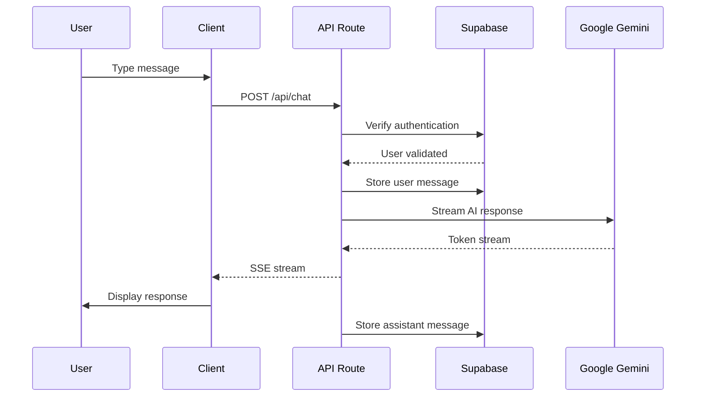

# AI Chat Assistant

A production-ready, real-time AI chatbot application with streaming responses, user authentication, chat persistence, and a modern responsive UI. Built with Next.js 14, Supabase, and Google Gemini AI.

## Table of Contents

- [Overview](#overview)
- [Features](#features)
- [Tech Stack](#tech-stack)
- [Architecture](#architecture)
- [Prerequisites](#prerequisites)
- [Installation](#installation)
- [Environment Configuration](#environment-configuration)
- [Development](#development)
- [API Documentation](#api-documentation)
- [Database Schema](#database-schema)
- [Deployment](#deployment)
- [Contributing](#contributing)
- [Security](#security)
- [Troubleshooting](#troubleshooting)
- [Roadmap](#roadmap)
- [License](#license)

## Overview

AI Chat Assistant is a full-stack conversational AI application that provides:

- Real-time token-by-token streaming responses
- Persistent chat history with multiple conversation threads
- Secure user authentication with email/password and magic link options
- AI-powered tool calling for weather, tasks, and recipes
- Customizable AI personas for different use cases
- Mobile-first responsive design with offline-capable features

## Features

### Core Functionality

- **Real-time Streaming**: Server-Sent Events (SSE) for token-by-token AI responses
- **Multi-thread Chat**: Create, manage, and switch between multiple conversations
- **Persistent History**: All messages stored securely in Supabase PostgreSQL
- **Auto-title Generation**: AI automatically generates descriptive chat titles

### Authentication

- **Email/Password**: Traditional secure authentication
- **Magic Link**: Passwordless email-based authentication
- **Session Management**: Automatic token refresh and secure cookie handling
- **Protected Routes**: Middleware-based route protection

### AI Tools

- **Weather Tool**: Get current weather for any city
- **Task Manager**: Create structured task lists with checklists
- **Recipe Generator**: Professional recipes with measurements and step-by-step instructions

### AI Personas

Five built-in personas optimized for different use cases:

1. **Code Expert**: Senior software engineer for code solutions
2. **Content Strategist**: Marketing and SEO expertise
3. **Friendly Tutor**: Patient educational explanations
4. **Technical Writer**: Clear documentation guidance
5. **Creative Brainstorm Partner**: Ideation and creative thinking

### UI/UX

- **Responsive Design**: Mobile-first approach with tablet and desktop layouts
- **Collapsible Sidebar**: Mobile drawer with slide-in animation
- **File Attachments**: Upload and preview images in chat
- **Smooth Animations**: Loading states, transitions, and micro-interactions
- **Dark Mode Ready**: CSS variables for theme switching

## Tech Stack

| Category | Technology |
|----------|------------|
| **Framework** | Next.js 14 (App Router) |
| **Language** | TypeScript 5.2 |
| **Styling** | Tailwind CSS 3.3 |
| **UI Components** | shadcn/ui, Radix UI |
| **State Management** | Zustand 5.0 |
| **Backend** | Next.js API Routes |
| **Database** | Supabase PostgreSQL |
| **Authentication** | Supabase Auth |
| **AI Provider** | Google Gemini (via Vercel AI SDK) |
| **AI SDK** | Vercel AI SDK 6.0 |
| **Icons** | Lucide React |
| **Date Utilities** | date-fns |
| **Markdown** | react-markdown, remark-gfm |

## Architecture

```
┌─────────────────────────────────────────────────────────────────┐
│                        CLIENT (Browser)                         │
├─────────────────────────────────────────────────────────────────┤
│  React Components │ Zustand Store │ Tailwind CSS │ WebSockets   │
└─────────────────────────────┬───────────────────────────────────┘
                              │
                              ▼
┌─────────────────────────────────────────────────────────────────┐
│                     NEXT.JS APP ROUTER                           │
├─────────────────────────────────────────────────────────────────┤
│  Server Components │ API Routes │ Middleware │ Server Actions   │
└──────────┬──────────────────┬──────────────────┬───────────────┘
           │                  │                  │
           ▼                  ▼                  ▼
┌─────────────────┐  ┌─────────────────┐  ┌─────────────────────┐
│    SUPABASE     │  │   GOOGLE AI     │  │     NETLIFY/VERCEL   │
│    DATABASE     │  │     GEMINI      │  │      HOSTING         │
│    AUTH         │  │                 │  │                      │
└─────────────────┘  └─────────────────┘  └─────────────────────┘
```

### Request Flow



### Project Structure

```
project/
├── app/
│   ├── (auth)/                    # Authentication route group
│   │   ├── layout.tsx             # Auth layout wrapper
│   │   └── login/
│   │       └── page.tsx           # Login page
│   ├── (dashboard)/               # Main app route group
│   │   ├── layout.tsx             # Dashboard layout with sidebar
│   │   ├── page.tsx               # Home (creates new chat)
│   │   └── chat/
│   │       └── [chatId]/
│   │           └── page.tsx       # Chat session page
│   ├── api/
│   │   ├── auth/
│   │   │   └── callback/
│   │   │       └── route.ts       # OAuth callback handler
│   │   └── chat/
│   │       ├── route.ts           # Main chat streaming endpoint
│   │       ├── tools.ts           # AI tool definitions
│   │       ├── schema.ts          # Zod schemas for tools
│   │       └── update-title/
│   │           └── route.ts       # Chat title update endpoint
│   ├── globals.css                # Global styles + Tailwind
│   ├── layout.tsx                 # Root layout
│   └── favicon.ico                # App icon
├── components/
│   ├── auth/
│   │   └── SignOutButton.tsx      # Sign out component
│   ├── cards/
│   │   ├── RecipeCard.tsx         # Recipe display card
│   │   ├── TaskCard.tsx           # Task list display card
│   │   └── WeatherCard.tsx        # Weather display card
│   ├── chat/
│   │   ├── ChatHeader.tsx         # Chat header with status
│   │   ├── ChatInput.tsx          # Message input component
│   │   ├── ChatWindow.tsx         # Main chat container
│   │   ├── EmptyState.tsx         # Empty chat suggestions
│   │   ├── MarkDownRenderer.tsx   # Markdown parsing
│   │   ├── MessageBubble.tsx      # Single message display
│   │   ├── MessageList.tsx        # Message list container
│   │   ├── MessagePartRenderer.tsx # AI tool result rendering
│   │   ├── MobileSidebarDrawer.tsx # Mobile sidebar drawer
│   │   ├── NewChatButton.tsx      # New chat action
│   │   ├── SidebarChatItem.tsx    # Single chat list item
│   │   ├── SidebarChatList.tsx    # Chat list sidebar
│   │   └── WorkspaceLoader.tsx    # Loading animation
│   └── ui/                        # shadcn/ui components
├── docs/                          # Documentation
├── hooks/
│   ├── use-toast.ts               # Toast notifications
│   └── useChatWindow.tsx          # Chat window state hook
├── lib/
│   ├── gemini.ts                  # Gemini client config
│   ├── openai.ts                  # OpenAI client config
│   ├── personas.ts                # Persona utilities
│   ├── supabase/
│   │   ├── client.ts              # Browser Supabase client
│   │   └── server.ts              # Server Supabase client
│   └── utils.ts                   # Utility functions
├── store/
│   └── useChatStore.tsx           # Zustand chat state store
├── supabase/
│   └── migrations/                # Database migrations
├── types/
│   ├── chat.ts                    # Chat type definitions
│   └── persona.ts                 # Persona type definitions
├── .env.example                   # Environment template
├── middleware.ts                  # Auth middleware
├── next.config.js                 # Next.js configuration
├── tailwind.config.ts             # Tailwind configuration
└── tsconfig.json                  # TypeScript configuration
```

## Prerequisites

- **Node.js** 18.x or later
- **npm** 9.x or later (or pnpm/yarn)
- **Supabase Account** ([create free](https://supabase.com))
- **Google AI API Key** ([get here](https://aistudio.google.com/apikey))

## Installation

### 1. Clone the Repository

```bash
git clone <repository-url>
cd ai-chat-assistant
```

### 2. Install Dependencies

```bash
npm install
```

### 3. Set Up Supabase

1. Create a new project at [supabase.com](https://supabase.com)
2. Go to Project Settings > API
3. Copy your project URL and anon/public key

4. Run the database migrations:

The application expects these tables (created via Supabase migrations):

```sql
-- chats table (auto-created by Supabase Auth trigger or manually)
CREATE TABLE chats (
  id uuid PRIMARY KEY DEFAULT gen_random_uuid(),
  user_id uuid REFERENCES auth.users(id) ON DELETE CASCADE,
  title text DEFAULT 'New Chat Session',
  created_at timestamptz DEFAULT now(),
  updated_at timestamptz DEFAULT now()
);

-- messages table
CREATE TABLE messages (
  id uuid PRIMARY KEY DEFAULT gen_random_uuid(),
  chat_id uuid REFERENCES chats(id) ON DELETE CASCADE,
  role text NOT NULL,
  content jsonb,
  created_at timestamptz DEFAULT now()
);

-- Enable RLS
ALTER TABLE chats ENABLE ROW LEVEL SECURITY;
ALTER TABLE messages ENABLE ROW LEVEL SECURITY;

-- RLS Policies for chats
CREATE POLICY "Users can manage own chats" ON chats
  FOR ALL TO authenticated
  USING (auth.uid() = user_id)
  WITH CHECK (auth.uid() = user_id);

-- RLS Policies for messages
CREATE POLICY "Users can manage own messages" ON messages
  FOR ALL TO authenticated
  USING (chat_id IN (SELECT id FROM chats WHERE user_id = auth.uid()))
  WITH CHECK (chat_id IN (SELECT id FROM chats WHERE user_id = auth.uid()));
```

### 4. Configure Environment Variables

```bash
cp .env.example .env.local
```

Edit `.env.local` with your values:

```env
# Supabase Configuration
NEXT_PUBLIC_SUPABASE_URL=https://your-project.supabase.co
NEXT_PUBLIC_SUPABASE_ANON_KEY=your-anon-key

# AI Configuration
GOOGLE_GENERATIVE_AI_API_KEY=your-gemini-api-key
```

### 5. Run Development Server

```bash
npm run dev
```

Open [http://localhost:3000](http://localhost:3000) in your browser.

## Environment Configuration

| Variable | Required | Description |
|----------|----------|-------------|
| `NEXT_PUBLIC_SUPABASE_URL` | Yes | Your Supabase project URL |
| `NEXT_PUBLIC_SUPABASE_ANON_KEY` | Yes | Supabase anonymous/public key |
| `GOOGLE_GENERATIVE_AI_API_KEY` | Yes | Google Gemini API key for AI responses |

### Getting API Keys

#### Supabase Keys

1. Navigate to [supabase.com](https://supabase.com) and open your project
2. Go to **Project Settings** > **API**
3. Copy **Project URL** (for `NEXT_PUBLIC_SUPABASE_URL`)
4. Copy **anon/public** key (for `NEXT_PUBLIC_SUPABASE_ANON_KEY`)

#### Google Gemini Key

1. Visit [Google AI Studio](https://aistudio.google.com/apikey)
2. Create a new API key
3. Copy the key for `GOOGLE_GENERATIVE_AI_API_KEY`

## Development

### Available Scripts

```bash
# Development server with hot reload
npm run dev

# Production build
npm run build

# Start production server
npm run start

# Run ESLint
npm run lint

# TypeScript type checking
npm run typecheck

# Run tests
npm test

# Run tests in watch mode
npm run test:watch
```

### Development Workflow

1. **Create a feature branch**: `git checkout -b feature/your-feature`
2. **Make changes and test**: `npm run dev`
3. **Run type checks**: `npm run typecheck`
4. **Run linting**: `npm run lint`
5. **Run tests**: `npm test`
6. **Build for production**: `npm run build`
7. **Create pull request**

### Code Style

- TypeScript strict mode enabled
- ESLint for code quality
- Prettier for formatting (recommended)
- Tailwind CSS for styling

## API Documentation

### Endpoints

#### `POST /api/chat`

Main chat endpoint for streaming AI responses.

**Request:**

```json
{
  "chatId": "uuid",
  "messages": [
    {
      "role": "user",
      "content": "Hello, how are you?"
    }
  ]
}
```

**Response:** Server-Sent Events stream

```
data: {"type":"text-delta","textDelta":"Hello"}
data: {"type":"text-delta","textDelta":"!"}
data: {"type":"finish"}
```

**Status Codes:**

| Code | Description |
|------|-------------|
| 200 | Successful stream |
| 401 | Unauthorized (invalid/missing auth) |
| 400 | Missing chatId parameter |
| 500 | Internal server error |

---

#### `POST /api/chat/update-title`

Update a chat session title.

**Request:**

```json
{
  "chatId": "uuid",
  "title": "New Chat Title"
}
```

**Response:**

```json
{
  "success": true
}
```

**Status Codes:**

| Code | Description |
|------|-------------|
| 200 | Title updated successfully |
| 401 | Unauthorized |
| 400 | Missing parameters |
| 500 | Internal server error |

---

#### `GET /api/auth/callback`

OAuth callback handler for magic link authentication.

**Query Parameters:**

| Parameter | Description |
|-----------|-------------|
| `code` | OAuth authorization code |
| `next` | Redirect path after auth (default: `/`) |

**Response:** Redirects to dashboard or login page

## Database Schema

### Tables

#### `chats`

| Column | Type | Description |
|--------|------|-------------|
| `id` | uuid | Primary key |
| `user_id` | uuid | Foreign key to auth.users |
| `title` | text | Chat session title |
| `created_at` | timestamptz | Creation timestamp |
| `updated_at` | timestamptz | Last update timestamp |

#### `messages`

| Column | Type | Description |
|--------|------|-------------|
| `id` | uuid | Primary key |
| `chat_id` | uuid | Foreign key to chats |
| `role` | text | Message role (user/assistant/system) |
| `content` | jsonb | Message content |
| `created_at` | timestamptz | Creation timestamp |

#### `personas`

| Column | Type | Description |
|--------|------|-------------|
| `id` | uuid | Primary key |
| `user_id` | uuid | Foreign key to auth.users (null for defaults) |
| `name` | text | Persona name |
| `description` | text | Persona description |
| `system_prompt` | text | System instructions |
| `is_default` | boolean | Built-in persona flag |
| `is_custom` | boolean | User-created flag |
| `created_at` | timestamptz | Creation timestamp |
| `updated_at` | timestamptz | Last update timestamp |

## Deployment

### Netlify (Recommended)

The project is configured for Netlify deployment:

1. Connect your repository to Netlify
2. Set environment variables in Netlify dashboard
3. Deploy automatically on push to main branch

**Configuration:** `netlify.toml` is included

### Vercel

1. Import project in Vercel dashboard
2. Set environment variables
3. Deploy

### Self-Hosted

```bash
# Build the application
npm run build

# Start production server
npm run start
```

The application runs on port 3000 by default.

### Docker (Optional)

```dockerfile
FROM node:18-alpine
WORKDIR /app
COPY package*.json ./
RUN npm ci --only=production
COPY . .
RUN npm run build
EXPOSE 3000
CMD ["npm", "start"]
```

## Contributing

Please read [CONTRIBUTING.md](CONTRIBUTING.md) for detailed contribution guidelines.

### Quick Start

1. Fork the repository
2. Create a feature branch
3. Make your changes
4. Run tests and lint
5. Submit a pull request

## Security

Please read [SECURITY.md](SECURITY.md) for security policy and reporting vulnerabilities.

### Key Security Features

- Server-side API key storage (never exposed to client)
- Row Level Security (RLS) on all database tables
- CSRF protection via Supabase
- Secure session management with httpOnly cookies
- Authentication middleware for route protection

## Troubleshooting

### Common Issues

#### "Unauthorized" error

- Verify your Supabase credentials in `.env.local`
- Check that your Supabase project is not paused
- Ensure RLS policies are configured correctly

#### Streaming not working

- Verify `GOOGLE_GENERATIVE_AI_API_KEY` is set
- Check that the Gemini API is accessible from your region
- Verify network requests in browser DevTools

#### Build failures

- Clear `.next` cache: `rm -rf .next`
- Reinstall dependencies: `rm -rf node_modules && npm install`
- Check Node.js version: `node --version` (need 18+)

#### Database connection errors

- Verify Supabase project URL is correct
- Check that tables exist in your Supabase dashboard
- Ensure migrations have been applied

### Getting Help

1. Check existing [Issues](../../issues)
2. Review [discussions](../../discussions)
3. Create a new issue with reproduction steps

## Roadmap

### v1.1 (Planned)

- [ ] Voice input support
- [ ] Image generation with DALL-E integration
- [ ] Chat sharing functionality
- [ ] Export chat to PDF/Markdown

### v1.2 (Planned)

- [ ] Team collaboration features
- [ ] Custom AI model fine-tuning
- [ ] Webhook integrations
- [ ] Plugin system

### Future

- [ ] Mobile app (React Native)
- [ ] Desktop app (Electron)
- [ ] CLI version
- [ ] API for third-party integration

## License

This project is licensed under the MIT License - see the [LICENSE](LICENSE) file for details.

## Acknowledgments

- [Vercel AI SDK](https://sdk.vercel.ai) for stream handling
- [Supabase](https://supabase.com) for backend infrastructure
- [shadcn/ui](https://ui.shadcn.com) for beautiful components
- Google Gemini for AI capabilities

---

Built with care by the AI Chat Assistant team.
