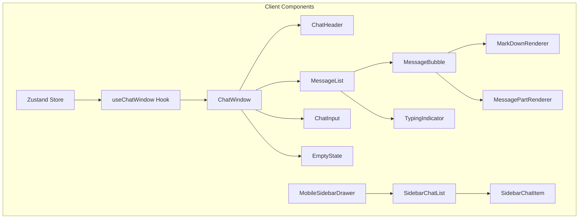
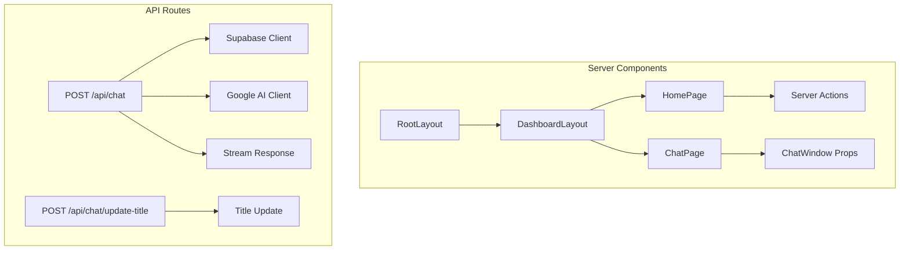
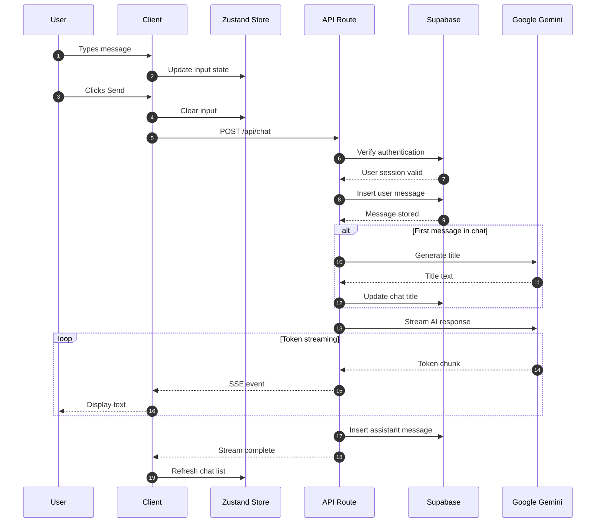
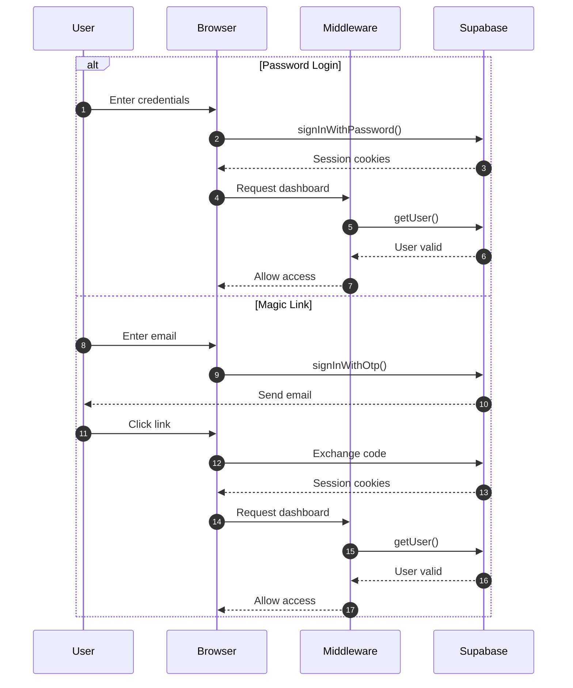
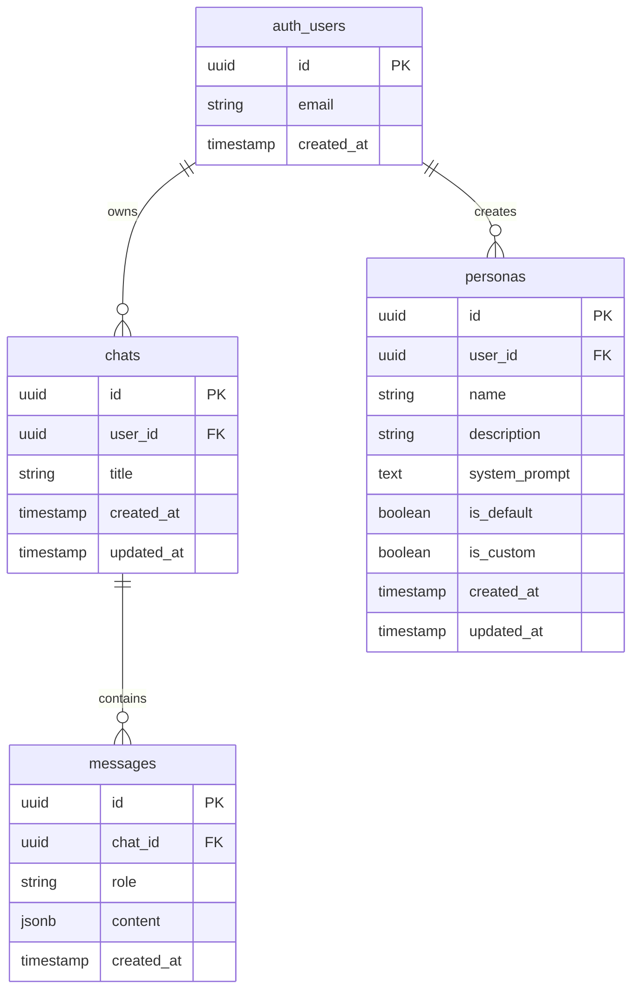

# Architecture Overview

This document provides a detailed technical overview of the AI Chat Assistant architecture, including system design, data flow, and integration patterns.

## System Architecture

### High-Level Overview

```
┌─────────────────────────────────────────────────────────────────────────────┐
│                              CLIENT LAYER                                    │
├─────────────────────────────────────────────────────────────────────────────┤
│                                                                              │
│   ┌──────────────┐   ┌──────────────┐   ┌──────────────┐                    │
│   │   Browser    │   │   Zustand    │   │   React      │                    │
│   │   Storage    │   │   Store      │   │   Components │                    │
│   └──────┬───────┘   └──────┬───────┘   └──────┬───────┘                    │
│          │                  │                  │                             │
│          └──────────────────┴──────────────────┘                             │
│                              │                                              │
└──────────────────────────────┼──────────────────────────────────────────────┘
                               │
                               ▼
┌─────────────────────────────────────────────────────────────────────────────┐
│                           APPLICATION LAYER                                  │
├─────────────────────────────────────────────────────────────────────────────┤
│                                                                              │
│   ┌──────────────────────────────────────────────────────────────────────┐  │
│   │                     NEXT.JS APP ROUTER                                │  │
│   │  ┌────────────────┐  ┌────────────────┐  ┌────────────────────────┐ │  │
│   │  │ Server         │  │ API Routes     │  │ Middleware              │ │  │
│   │  │ Components     │  │                │  │                         │ │  │
│   │  │                │  │  • /api/chat   │  │  • Auth verification    │ │  │
│   │  │  • Layouts     │  │  • /api/update │  │  • Route protection     │ │  │
│   │  │  • Pages       │  │  • /api/auth   │  │  • Cookie handling      │ │  │
│   │  └────────────────┘  └────────────────┘  └────────────────────────┘ │  │
│   └──────────────────────────────────────────────────────────────────────┘  │
│                                                                              │
└──────────────────────────────┬──────────────────────────────────────────────┘
                               │
          ┌────────────────────┼────────────────────┐
          │                    │                    │
          ▼                    ▼                    ▼
┌──────────────────┐  ┌──────────────────┐  ┌──────────────────┐
│    SUPABASE      │  │   GOOGLE AI      │  │    NETLIFY       │
│                  │  │                  │  │                  │
│  ┌────────────┐  │  │  ┌────────────┐  │  │  ┌────────────┐  │
│  │ PostgreSQL │  │  │  │   Gemini   │  │  │  │   Edge     │  │
│  │ Database   │  │  │  │   Models   │  │  │  │   CDN      │  │
│  └────────────┘  │  │  └────────────┘  │  │  └────────────┘  │
│                  │  │                  │  │                  │
│  ┌────────────┐  │  │  ┌────────────┐  │  │  ┌────────────┐  │
│  │   Auth     │  │  │  │  Token     │  │  │  │  Server    │  │
│  │   Service  │  │  │  │  Streaming │  │  │  │  Functions │  │
│  └────────────┘  │  │  └────────────┘  │  │  └────────────┘  │
│                  │  │                  │  │                  │
│  ┌────────────┐  │  │                  │  │                  │
│  │ RLS        │  │  │                  │  │                  │
│  │ Policies   │  │  │                  │  │                  │
│  └────────────┘  │  │                  │  │                  │
└──────────────────┘  └──────────────────┘  └──────────────────┘
```

## Component Architecture

### Frontend Components



### Server Components



## Data Flow

### Chat Message Flow



### Authentication Flow



## State Management

### Zustand Store Structure

```typescript
interface ChatState {
  // State
  chats: Chat[];
  isLoading: boolean;

  // Actions
  setChats: (chats: Chat[]) => void;
  deleteChat: (chatId: string) => Promise<void>;
}
```

### React Hook State (useChatWindow)

```typescript
interface UseChatWindowState {
  // Form State
  input: string;
  previewUrl: string | null;
  selectedFile: File | null;

  // UI State
  isHydrated: boolean;
  isExiting: boolean;

  // AI SDK Hook
  messages: UIMessage[];
  status: 'ready' | 'streaming' | 'submitted' | 'error';

  // Actions
  handleSend: () => Promise<void>;
  handleChange: (e: ChangeEvent) => void;
  stop: () => void;
}
```

## Database Schema

### Entity Relationship Diagram



## Security Architecture

### Authentication & Authorization

```
┌─────────────────────────────────────────────────────────────┐
│                     REQUEST FLOW                             │
├─────────────────────────────────────────────────────────────┤
│                                                              │
│  1. Browser Request                                         │
│         │                                                    │
│         ▼                                                    │
│  2. Middleware Check                                        │
│     ├── Public route? → Allow                               │
│     ├── Protected route?                                     │
│     │   ├── Get session from Supabase                       │
│     │   ├── Valid session? → Allow                          │
│     │   └── Invalid session? → Redirect to login             │
│         │                                                    │
│         ▼                                                    │
│  3. API Route Handler                                       │
│     ├── Verify user again (defense in depth)                 │
│     ├── Execute operation                                   │
│     └── Return response                                      │
│                                                              │
└─────────────────────────────────────────────────────────────┘
```

### Row Level Security (RLS) Policies

```sql
-- Chats table
CREATE POLICY "Users can manage own chats"
  ON chats FOR ALL TO authenticated
  USING (auth.uid() = user_id)
  WITH CHECK (auth.uid() = user_id);

-- Messages table
CREATE POLICY "Users can manage own messages"
  ON messages FOR ALL TO authenticated
  USING (chat_id IN (
    SELECT id FROM chats WHERE user_id = auth.uid()
  ))
  WITH CHECK (chat_id IN (
    SELECT id FROM chats WHERE user_id = auth.uid()
  ));

-- Personas table (mixed access)
CREATE POLICY "Read default personas"
  ON personas FOR SELECT TO authenticated
  USING (is_default = true);

CREATE POLICY "Manage custom personas"
  ON personas FOR ALL TO authenticated
  USING (auth.uid() = user_id AND is_custom = true);
```

## AI Integration

### Tool Calling Architecture

```
┌─────────────────────────────────────────────────────────────┐
│                    AI TOOL FLOW                              │
├─────────────────────────────────────────────────────────────┤
│                                                              │
│  User Query: "What's the weather in Tokyo?"                  │
│         │                                                    │
│         ▼                                                    │
│  ┌─────────────────────────────────────────┐                 │
│  │         Google Gemini Model             │                 │
│  │                                         │                 │
│  │  1. Analyze query intent                │                 │
│  │  2. Match to available tools            │                 │
│  │  3. Extract parameters                  │                 │
│  └─────────────────────────────────────────┘                 │
│         │                                                    │
│         ▼                                                    │
│  Tool Call: showWeather(location: "Tokyo")                  │
│         │                                                    │
│         ▼                                                    │
│  ┌─────────────────────────────────────────┐                 │
│  │         Tool Execution                  │                 │
│  │                                         │                 │
│  │  • Validate input via Zod schema        │                 │
│  │  • Execute tool logic                   │                 │
│  │  • Return structured result             │                 │
│  └─────────────────────────────────────────┘                 │
│         │                                                    │
│         ▼                                                    │
│  Result: { city: "Tokyo", temperature: "32" }                │
│         │                                                    │
│         ▼                                                    │
│  ┌─────────────────────────────────────────┐                 │
│  │         UI Rendering                    │                 │
│  │                                         │                 │
│  │  WeatherCard component receives data   │                 │
│  │  Renders formatted weather display     │                 │
│  └─────────────────────────────────────────┘                 │
│                                                              │
└─────────────────────────────────────────────────────────────┘
```

### Available Tools

| Tool | Purpose | Schema |
|------|---------|--------|
| `showWeather` | Get weather for a city | `{ location: string }` |
| `showTasks` | Create task lists | `{ title: string, tasks: Task[] }` |
| `showRecipe` | Generate recipes | `RecipeSchema` (full schema) |

## Performance Considerations

### Optimization Strategies

1. **Streaming**: Real-time token display reduces perceived latency
2. **Optimistic Updates**: UI updates before server confirmation
3. **Code Splitting**: Dynamic imports for large components
4. **Image Optimization**: Next.js Image component for attachments
5. **Edge Caching**: Netlify CDN for static assets

### Bundle Size

| Chunk | Size (approx) |
|-------|---------------|
| Main App | ~83 KB |
| Chat Page | ~107 KB |
| Shared | ~82 KB |

## Scalability

### Horizontal Scaling

- Stateless API routes (session in cookies)
- Database connection pooling via Supabase
- CDN for static assets
- Edge functions for regional distribution

### Rate Limiting (Recommended)

For production, implement rate limiting:

```typescript
// Example with Upstash
import { Ratelimit } from "@upstash/ratelimit";

const ratelimit = new Ratelimit({
  redis: redis,
  limiter: Ratelimit.slidingWindow(10, "10 s"),
});

// In API route
const { success } = await ratelimit.limit(user.id);
if (!success) {
  return new Response("Too many requests", { status: 429 });
}
```

## Monitoring & Observability

### Recommended Tools

- **Vercel Analytics**: Page views, performance
- **Sentry**: Error tracking and performance
- **Supabase Dashboard**: Database metrics
- **Google AI Studio**: API usage and costs

### Key Metrics

| Metric | Target |
|--------|--------|
| Time to First Token | < 500ms |
| Page Load (LCP) | < 2.5s |
| Error Rate | < 1% |
| Database Query Time | < 100ms |

## Future Architecture

### Planned Improvements

1. **WebSocket Support**: Replace SSE for bidirectional communication
2. **Multi-model Support**: Switch between AI providers
3. **Vector Search**: Semantic chat history search
4. **Real-time Collaboration**: Multi-user presence
5. **Offline Support**: IndexedDB for offline message queue
